# Flight Booking System

<div style="display: flex; justify-content: center; margin-bottom: 10px;">
    
</div>

**We'll cover the following:**

- [Overview](#overview)
- [Features](#features)
- [Installation](#installation)
- [Use case](#use-case)
- [Diagrams](#diagrams)
- [Results](#results)
- [Contributors](#contributors)

## Overview

The Flight Management System is a web application designed to manage flight reservations, schedules, and user profiles. It provides functionalities for users to search for flights, make reservations, and manage their bookings. The system also includes administrative features for managing flights, routes, and user accounts.

## Features

- Signup, login with google oauth
- Randomize avatar for new users (Cloudinary)
- Reset password with token-based email verification
- Search for flights based on routes and dates
- View flight details
- Make, manage and pay flight reservations (VNPay)
- Admin page for managing models
- Flight scheduling

## Installation

1. **Clone the repository:**

   ```bash
   git clone https://github.com/huywindear004/Flight-Booking-Management.git
   ```

2. **Install the dependencies:**

   ```bash
   pip install -r backend/requirements.txt
   ```

3. **Set up environment variables:**

   Create a [.env](http://_vscodecontentref_/1) file in the backend/ directory and add the following environment variables:

   ```.env
   MYSQL_PASSWORD=
   MYSQL_USER=
   MYSQL_HOST=
   MYSQL_DATABASE=
   MYSQL_HOST_PORT=

   SECRET_KEY=

   CLOUDINARY_CLOUD_NAME =
   CLOUDINARY_API_KEY =
   CLOUDINARY_API_SECRET =
   CLOUDINARY_SECURE=
   CLOUDINARY_DEFAULT_AVATARS_PATH= # The path that contains default avatars on Cloudinary

   VNPAY_RETURN_URL =
   VNPAY_PAYMENT_URL =
   VNPAY_API_URL =
   VNPAY_TMN_CODE =
   VNPAY_HASH_SECRET_KEY =

   MAIL_SERVER =
   MAIL_PORT =
   MAIL_USE_TLS =
   MAIL_USE_SSL =
   MAIL_USERNAME =
   MAIL_PASSWORD =
   ```

4. **Set up Google OAuth:**

   Create a project on the [Google Cloud Platform](https://console.cloud.google.com/). Enable the Google+ API and create OAuth 2.0 credentials. Add the client_secret.json file to the backend/ directory. It should be something like this:

   ```json
   {
      "web": {
        "client_id": ...,
        "project_id": ...,
        "auth_uri": ...,
        "token_uri": ...,
        "auth_provider_x509_cert_url": ...,
        "client_secret": ...,
        "redirect_uris": ...,
        "javascript_origins": ...
      }
    }
   ```

5. **Initialize the database:**
   Create a MySQL database and run [seed.py](./backend/seed/seed.py) to populate the database with initial data.

6. **Run the application:**

   ```bash
   python backend/run.py
   ```

## Use case

Main actors:

- Admin: \*\*has access to all the stuff, can view statistics of flights
- Flight manager: Responsible for adding new flights and their schedules, canceling any flight, maintaining staff-related work, etc.
- Sales staff: Responsible for selling ticket, can book flights 4h before departure time.
- Customer: Can view flight, reserve & pay flights 12h before departure time.
- System: Mainly responsible for sending notifications, emails.

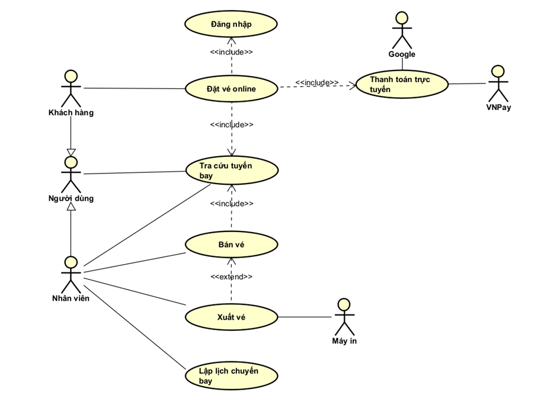
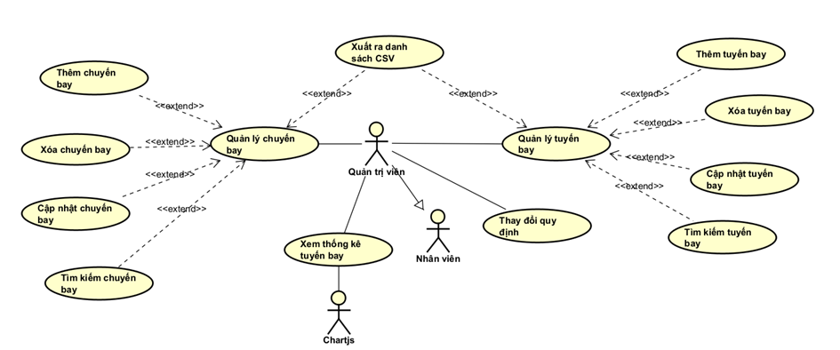

## Diagrams

### System architecture


### Class diagram

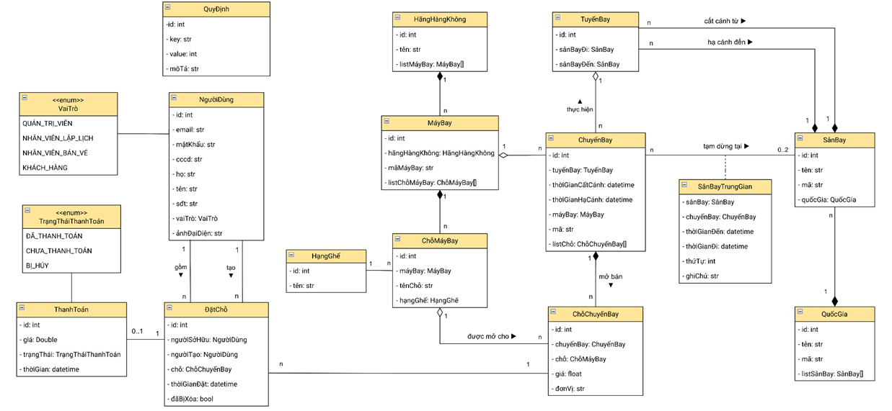

### ... The remaining is in [hear](./Quản%20lý%20chuyến%20bay%20nhóm%209.docx)

## Results

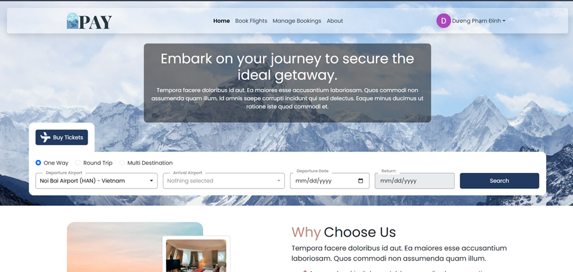
<div style="text-align: center; margin-bottom: 10px;"><i>Home page</i></div>
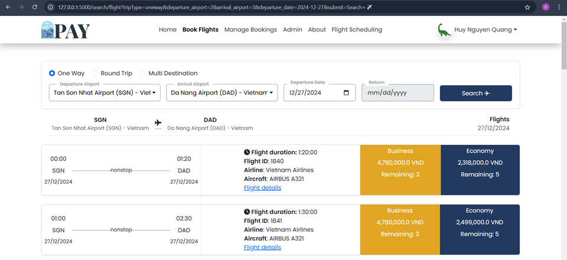
<div style="text-align: center; margin-bottom: 10px;"><i>Flight searching</i></div>
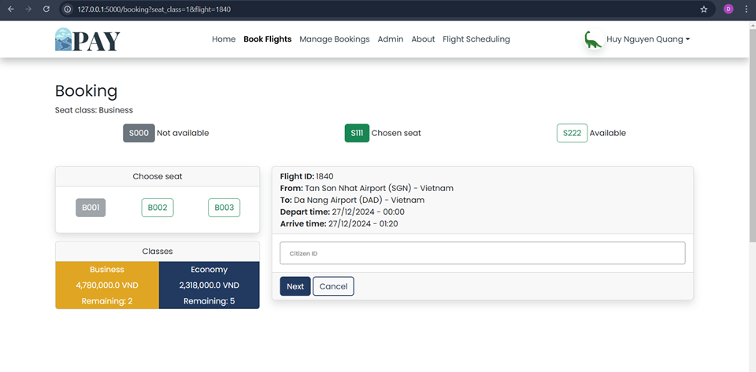
<div style="text-align: center; margin-bottom: 10px;"><i>Seat booking</i></div>
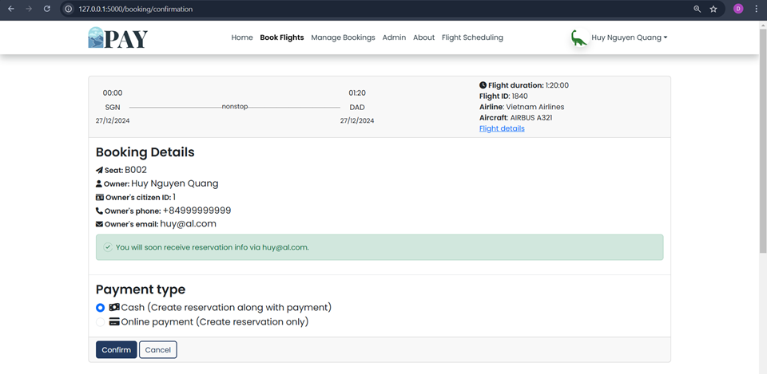
<div style="text-align: center; margin-bottom: 10px;"><i>Confirmation</i></div>
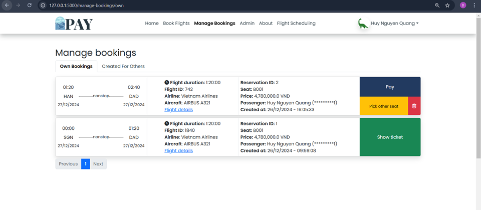
<div style="text-align: center; margin-bottom: 10px;"><i>Manage reservations</i></div>
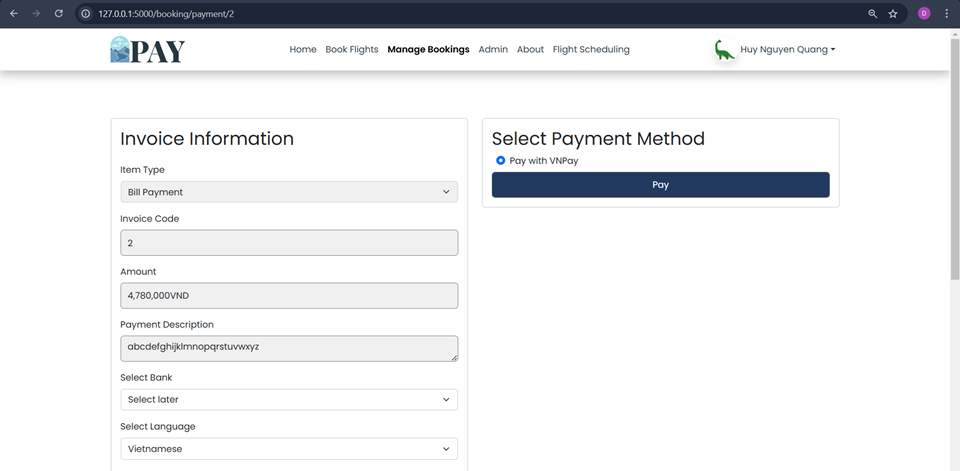
<div style="text-align: center; margin-bottom: 10px;"><i>Pay</i></div>
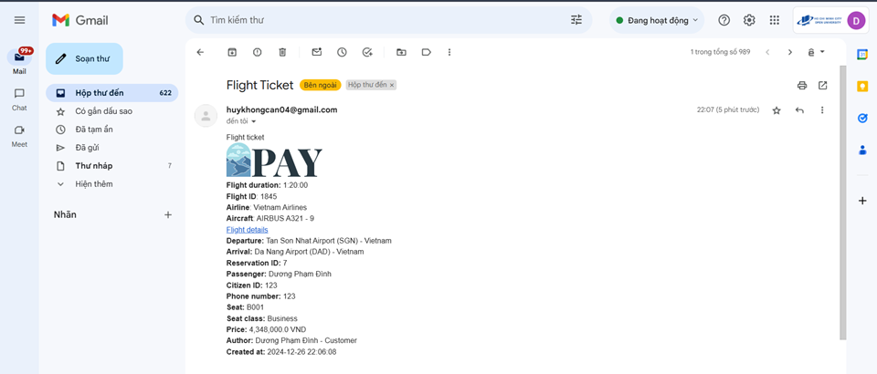
<div style="text-align: center; margin-bottom: 10px;"><i>Send ticket by email</i></div>
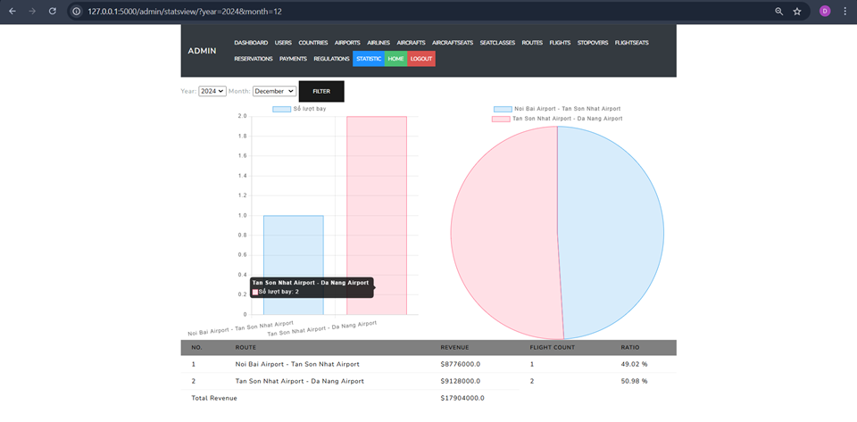
<div style="text-align: center; margin-bottom: 10px;"><i>Statistics</i></div>
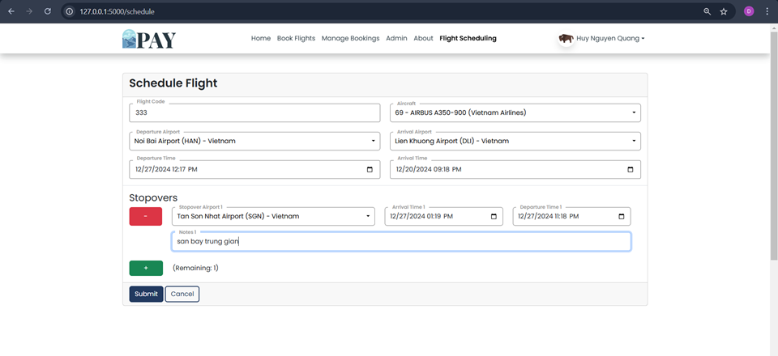
<div style="text-align: center; margin-bottom: 10px;"><i>Flight scheduling</i></div>

## Contributors

- Phạm Đình Dương
- Nguyễn Quang Huy
- Văn Phạm Gia Huy
